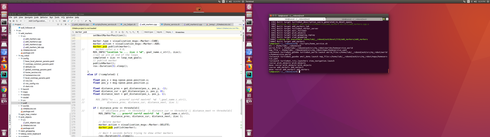
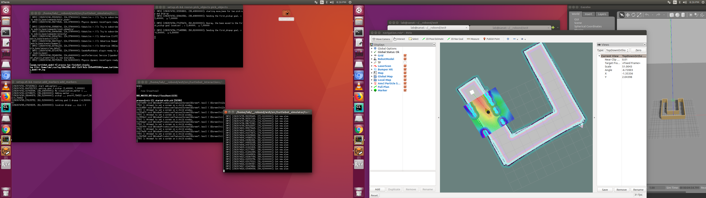
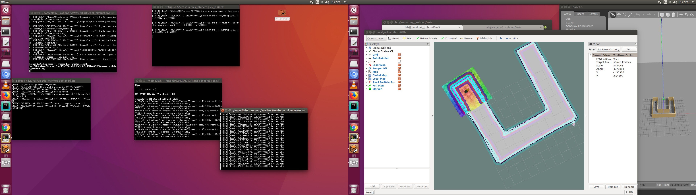
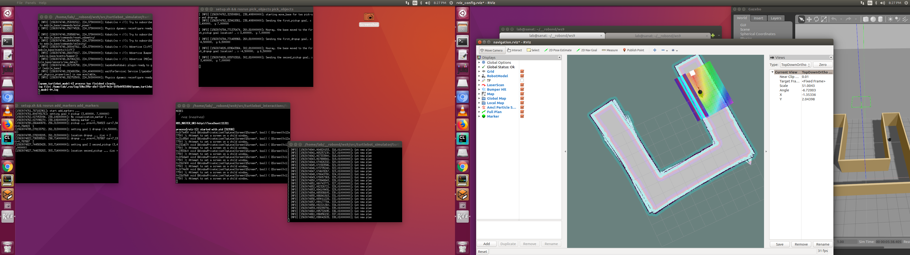
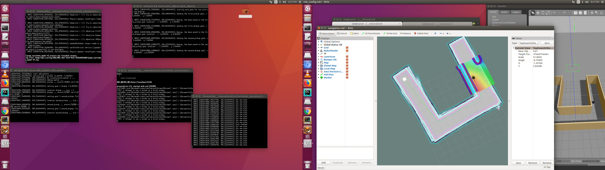
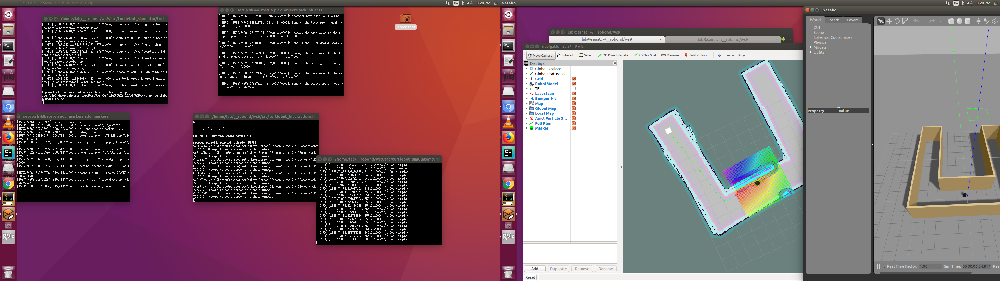
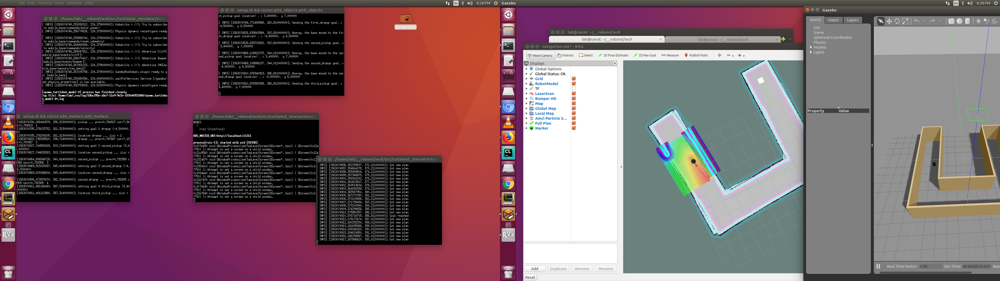
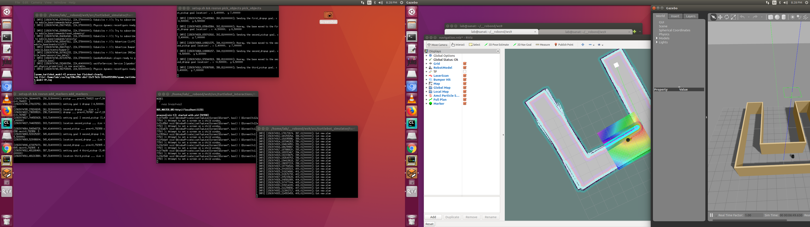

[](https://www.udacity.com/robotics)

#  Path Planning and Navigation - Home Service Ros Robot
## Project Overview

 Program a home service robot that will autonomously map an environment and navigate to 
 pickup and deliver objects!


 The directory structure and contain all the files listed here:

    .ws9                          # Home Service Ros Robot
    ├──                                # Official ROS packages
    |
    ├── slam_gmapping                  # gmapping_demo.launch file
    │   ├── gmapping
    │   ├── ...
    ├── turtlebot                      # keyboard_teleop.launch file
    │   ├── turtlebot_teleop
    │   ├── ...
    ├── turtlebot_interactions         # view_navigation.launch file
    │   ├── turtlebot_rviz_launchers
    │   ├── ...
    ├── turtlebot_simulator            # turtlebot_world.launch file
    │   ├── turtlebot_gazebo
    │   ├── ...
    ├──                                 
    |
    ├── src
    │  ├── my_robot                       # my_robot package                   
    │  │   ├── config                     # amc config pointcloud   
    │  │   │   ├── base_local_planner_params.yaml
    │  │   │   ├── costmap_common_params.yaml
    │  │   │   ├── global_costmap_params.yaml
    │  │   │   ├── local_costmap_params.yaml
    │  │   │   ├── rviz.rviz
    │  │   │   ├── slam.rviz
    │  │   │   ├── homeservice.rviz
    │  │   ├── launch                     # launch folder for launch files   
    │  │   │   ├── amcl.launch
    │  │   │   ├── mapping.launch
    │  │   │   ├── localization.launch
    │  │   │   ├── teleop.launch
    │  │   │   ├── robot_description.launch
    │  │   │   ├── world.launch
    │  │   ├── maps                     # map   
    │  │   │   ├── homeservice.pgm
    │  │   │   ├── homeservice.yaml
    │  │   │   ├── map.pgm
    │  │   │   ├── map.yaml
    │  │   │   ├── new_office_world_map.pgm
    │  │   │   ├── new_office_world_map.yaml
    │  │   │   ├── newofficeworld.pgm
    │  │   │   ├── newofficeworld.yaml
    │  │   │   ├── udacity_map.pgm
    │  │   │   ├── udacity_map.yaml
    │  │   │   ├── worldoffice2.pgm
    │  │   │   ├── worldoffice2.yaml
    │  │   │   ├── worldoffice_map1.pgm
    │  │   ├── src                        # source folder for C++ scripts
    │  │   │   ├── navigation_goal.cpp
    │  │   ├── meshes                     # meshes folder for sensors
    │  │   │   ├── hokuyo.dae
    │  │   ├── urdf                       # urdf folder for xarco files
    │  │   │   ├── my_robot.gazebo
    │  │   │   ├── my_robot.xacro
    │  │   ├── world                      # world folder for world files
    │  │   │   ├── empty.world
    │  │   │   ├── homeservice.world
    │  │   │   ├── myoffice.world
    │  │   │   ├── new_office_world
    │  │   │   ├── newofficeworld.world
    │  │   │   ├── office_pnd.world
    │  │   │   ├── worldoffice
    │  │   │   ├── worldoffice2
    │  │   ├── CMakeLists.txt             # compiler instructions
    │  │   ├── package.xml                # package info
    │  ├── add_markers                    # add_markers                   
    │  │   ├── src                        # source folder for C++ scripts
    │  │   │   ├── add_markers.cpp
    │  │   │   ├── add_markers_lab.cpp
    │  │   ├── CMakeLists.txt             # compiler instructions
    │  │   ├── package.xml                # package info                  
    │  ├── pick_objects                    # add_markers                   
    │  │   ├── src                        # source folder for C++ scripts
    │  │   │   ├── pick_objects.cpp
    │  │   ├── CMakeLists.txt             # compiler instructions
    │  │   ├── package.xml                # package info                  
    │  ├── wall_follower                    # add_markers                   
    │  │   ├── src                        # source folder for C++ scripts
    │  │   │   ├── wall_follower.cpp
    │  │   ├── CMakeLists.txt             # compiler instructions
    │  │   ├── package.xml                # package info                  
    │  └──                              
    ├── images                            # results screen shots
    ├── scrript                           # script
    │   ├── _ros_helper.sh                #  helper script
    │   ├── home_service.sh               # home_service script                  
    │   ├── launch.sh                     # home_service script                  
    │   ├── add_markers.sh                # add_markers script                  
    │   ├── pick_objects.sh               # pick_objects script                  
    │   ├── wall_follower.sh              # wall_follower script                  
    │   ├── test_navigation.sh            # test_navigation script                  
    │   ├── test_slam.sh                  # test_slam script          


     
     
     
 
 

## installation

```
$ mkdir -p ~/ws9/src
$ cd ~/ws9/src
$ catkin_init_workspace
$ cd ..
$ catkin_make
$ sudo apt-get update && apt-get upgrade
$ cd ~/ws9/src
$ git clone https://github.com/ros-perception/slam_gmapping
$ git clone https://github.com/turtlebot/turtlebot
$ git clone https://github.com/turtlebot/turtlebot_interactions
$ git clone https://github.com/turtlebot/turtlebot_simulator
$ cd ~/ws9/
$ source devel/setup.bash
$ rosdep -i install gmapping
$ rosdep -i install turtlebot_teleop
$ rosdep -i install turtlebot_rviz_launchers
$ rosdep -i install turtlebot_gazebo
$ rosdep -i install rtabmap_ros joy
$ catkin_make
$ source devel/setup.bash
```
##  Official ROS packages 
 
### gmapping: 
    http://wiki.ros.org/gmapping
    With the gmapping_demo.launch file, you can easily perform SLAM and build a map of 
    the environment with a robot equipped with laser range finder sensors or RGB-D cameras.

### turtlebot_teleop: 
    http://wiki.ros.org/turtlebot_teleop
    With the keyboard_teleop.launch file, you can manually control a robot using keyboard commands.

### turtlebot_rviz_launchers: 
    http://wiki.ros.org/turtlebot_rviz_launchers
    With the view_navigation.launch file, you can load a preconfigured rviz workspace. 
    You’ll save a lot of time by launching this file, because it will automatically load the robot model, 
    trajectories, and map for you.

### turtlebot_gazebo: 
    http://wiki.ros.org/turtlebot_gazebo
    With the turtlebot_world.launch you can deploy a turtlebot in a gazebo environment by linking the world 
    file to it.
    
### amcl: 
    http://wiki.ros.org/amcl
    amcl is a probabilistic localization system for a robot moving in 2D. It implements the adaptive
     (or KLD-sampling) Monte Carlo localization approach (as described by Dieter Fox),
     which uses a particle filter to track the pose of a robot against a known map. 
 
### rtabmap_ros: 
    http://wiki.ros.org/rtabmap_ros
    This package is a ROS wrapper of RTAB-Map (Real-Time Appearance-Based Mapping), a RGB-D 
    SLAM approach based on a global loop closure detector with real-time constraints. This package can be
    used to generate a 3D point clouds of the environment and/or to create a 2D occupancy grid map for navigation. 
    The tutorials and demos show some examples of mapping with RTAB-Map. 
 


  

## scripts

#### run rviz

rviz working. 
```
$ ./script/launch.sh
```
#### run add markers 

test add markers. 
```
$ ./script/add_markers.sh
```
#### run pick objects 

test pick_objects. 
```
$ ./script/pick_objects.sh
```

#### test wall_follower

test robot follows wall in endless loop. 
```
$ ./script/wall_follower.sh
```

#### test test_navigation

drive robot manually. 
```
$ ./script/test_navigation.sh
```

#### test test_slam

drive robot manually and slam. 
```
$ ./script/test_slam.sh
```

#### test home service 

object pick and drop off. 
```
$ ./script/home_service.sh
```

## results
 
Note that some example snapshots of the robot simulator can be found inside the folder **images/**.

#### home service results



 


 


 


 
 






 
 



   
